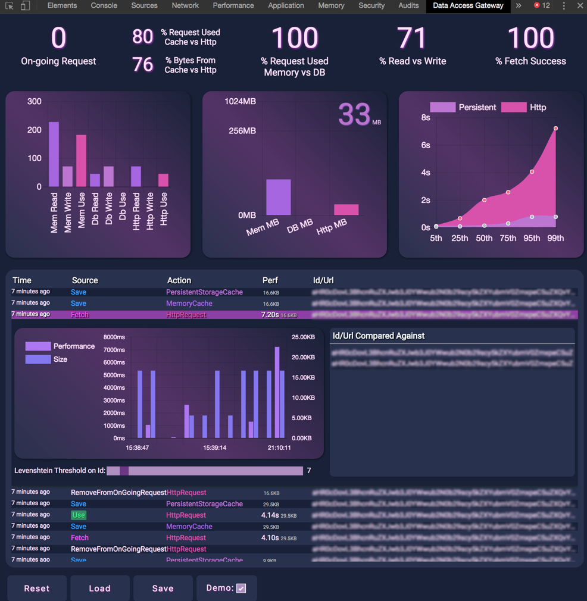
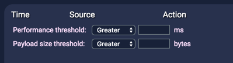
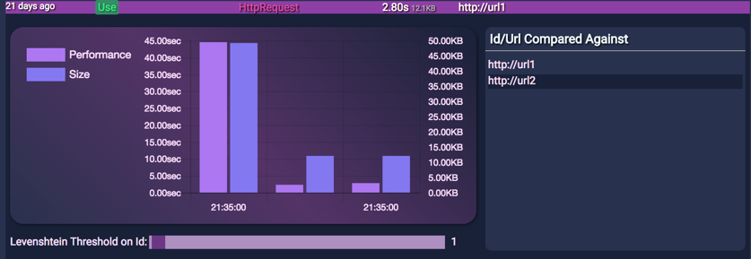

# Data Access Gateway Chrome Extension

This is the source code for the [Data Access Gateway library](https://github.com/MrDesjardins/dataaccessgateway). The goal of this Chrome Extension is to receive statistics about how the data is fetched and saved by the library.

## Why?
The extension goal is to provide insight about how the library is manipulating the data. It will indicate how many question are still pending (on-going request), and will give information about which source of data is trying read and write (memory, IndexDb or Http). It also give statistic to which of the three source the data is used as well as a complete list of URL (id) that is being accessed by the system.

## Features
The extension is literally the extension of the [Data Access Gateway library](https://github.com/MrDesjardins/dataaccessgateway). It gives insight about what is being used, when, what was the size of the payload and how long it tooks to be distributed to your application. It shows if the memory cache, or the persisted cache (IndexDb) is used and how many requests and bytes are you saving.

1. Quick glance information
    1. about how many request are running in the background
    2. Percentage of fetch coming from the cache compared to server
    3. Distribution of memory cache versus browser indexDb cache
2. Chart
    1. Number of read, write and use of memory cache, index db cache and HTTP request
    2. Distribution of the used bytes coming from the three sources
    3. Percentile of the usage from indexdb vs http
3. Console
    1. Historical view of all fetch, save in cache, read, on-going request
    2. Performance for each operation, bytes transfered and write in cache
    3. Drill in for further analysis
        1. Compare a single operation against previous one
        2. Allows to compare against similar query (different query string or URL fragment)
4. Possility to save session and load to have bigger historical analysis
5. Possible to switch in "demo mode" which blur all url for easy sharing without leaking confidential endpoints.

# Details

## Diving In Console

### Header
The header of the console can be clicked. It will open a panel. The panel contains option to filter the grid. Changing the value will trim the number of result in the grid allowing to see large payload in size or long request.

### Line

Every line of the console can be clicked. It opens the detailled view of a single request. The view allows to see in detail every ID (URL) that was executed to compare it against the one selected. This will filter by the line "action". For example, if the selected time is an action of "use" it will generate a graph of all the "action" for the same url. However, this is configurable. It is possible to use a slider to move a threshold value which will be used to compare ID (URL) with the Levenshtein algorithm. The configuration allows to bring in the analysis ID (URL) that change because of query string value that are different. For example, in the image below, the threshold is set to 1. It allows 1 character permutation. The line is for "http://url2" but the analysis includes "http://url1" as well. This can be adjusted to work for REST Api URL format and allow to see if specific parameter influence the performance or the payload size.

# Developer Readme
If you want to contribute to this Chrome Extension here are some details.

The technologies used it TypeScript and React. TypeScript is used for the agent and the Chrome Extension which is a panel that is inserted in the Chrome's developer tool. React is used inside the panel where the information about the Data Access Gateway.

At the moment, there is some fake data allowing to see the UI and play around when modifying or adding fearures. A caveat is how to execute the NPM scripts. Some copy use `cpx` but some not. For some reasons it does not work properly when moving code between the two projects. I have not invested any time on it and focused that it work on a Mac OS. I'll fix that later.

## Here are the steps for developing the panel

_The panel is what is injected inside Chrome Developer tool. This is what should be done when changing features on the extension most of the time._

1. At the root: `npm install`
2. Move to the `devpanel`
3. `yarn install`
4. To run in browser: `npm run start`
or
4. To build: `npm run fullbuildmac`. This will build and move the files in the extension `dist` folder. You can then use Chrome to load that folder from `chrome://extensions` and use the extension on real website using the Data Access Gateway library.

## Here are the steps for building the Chrome's extension
_The Chrome Extension is what communicate between the library and the Chrome's extension. This should rarely be changed._

1. At the root: `npm install`
2. `npm run build`
3. Go in the developer tool of Chrome, load the package to the `dist` folder.

## When developing the extension, make sure to always

1. Load once the extension from the Chrome's Extension `chrome://extensions`
2. Close and open the Chrome's Dev Tools every time `npm run fullbuildmac` is executed

# Todos

1. Unit tests
2. Large data set make the UI lag. Too much information is loaded in the console. We could use some virtualization and purge some data after some time.
3. UI could be improved. A balance between simplicity and density of information should be always respected.